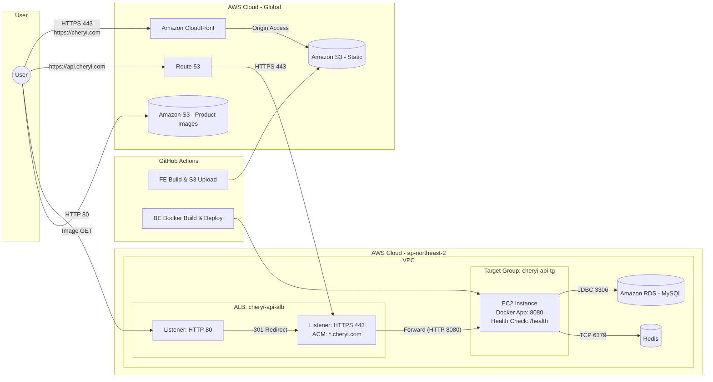

# CI/CD & Runtime Architecture (Frontend + Backend)

```mermaid
flowchart LR
    subgraph CI_CD [GitHub Actions]
        GHA_FE[FE Build & S3 Upload]
        GHA_BE[BE Docker Build & Deploy]
    end

    subgraph User_Interaction [User]
        User((User))
    end

    subgraph AWS_Global [AWS Cloud - Global]
        Route53[Route 53]
        CloudFront[Amazon CloudFront]
        S3Static[(Amazon S3 - Static)]
        S3Media[(Amazon S3 - Product Images)]
    end

    subgraph AWS_Region [AWS Cloud - ap-northeast-2]
        subgraph VPC [VPC]
            subgraph ALB [ALB: cheryi-api-alb]
                L80[Listener: HTTP 80]
                L443[Listener: HTTPS 443\nACM: *.cheryi.com]
            end

            subgraph Target_Group [Target Group: cheryi-api-tg]
                EC2[EC2 Instance\nDocker App: 8080\nHealth Check: /health]
            end

            RDS[(Amazon RDS - MySQL)]
            Redis[(Redis)]
        end
    end

    %% CI/CD Flow
    GHA_FE --> S3Static
    GHA_BE --> EC2

    %% Frontend Flow
    User -- "HTTPS 443\nhttps://cheryi.com" --> CloudFront
    CloudFront -- "Origin Access" --> S3Static

    %% Backend Flow
    User -- "https://api.cheryi.com" --> Route53
    Route53 -- "HTTPS 443" --> L443
    User -- "HTTP 80" --> L80
    L80 -- "301 Redirect" --> L443
    L443 -- "Forward (HTTP 8080)" --> EC2
    EC2 -- "JDBC 3306" --> RDS
    EC2 -- "TCP 6379" --> Redis

    %% Media Flow
    User -- "Image GET" --> S3Media
```
