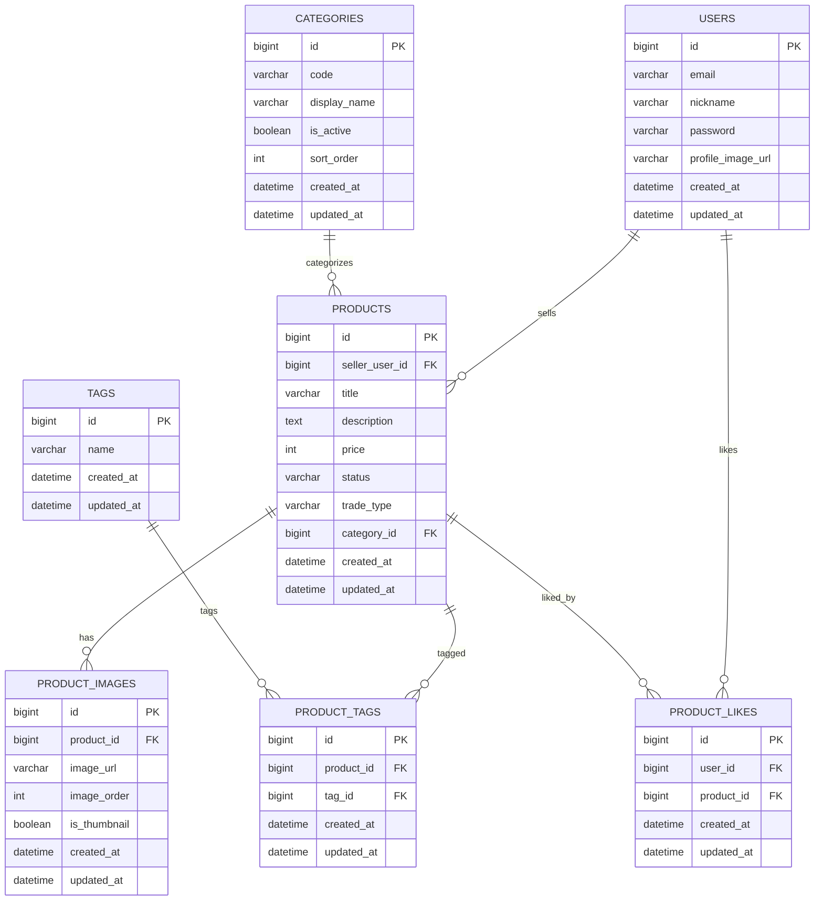

# ERD

```mermaid
erDiagram
  USERS ||--o{ PRODUCTS : sells
  CATEGORIES ||--o{ PRODUCTS : categorizes
  PRODUCTS ||--o{ PRODUCT_IMAGES : has
  PRODUCTS ||--o{ PRODUCT_TAGS : tagged
  TAGS ||--o{ PRODUCT_TAGS : tags
  USERS ||--o{ PRODUCT_LIKES : likes
  PRODUCTS ||--o{ PRODUCT_LIKES : liked_by

  USERS {
    bigint id PK
    varchar email
    varchar nickname
    varchar password
    varchar profile_image_url
    datetime created_at
    datetime updated_at
  }

  CATEGORIES {
    bigint id PK
    varchar code
    varchar display_name
    boolean is_active
    int sort_order
    datetime created_at
    datetime updated_at
  }

  PRODUCTS {
    bigint id PK
    bigint seller_user_id FK
    varchar title
    text description
    int price
    varchar status
    varchar trade_type
    bigint category_id FK
    datetime created_at
    datetime updated_at
  }

  PRODUCT_IMAGES {
    bigint id PK
    bigint product_id FK
    varchar image_url
    int image_order
    boolean is_thumbnail
    datetime created_at
    datetime updated_at
  }

  TAGS {
    bigint id PK
    varchar name
    datetime created_at
    datetime updated_at
  }

  PRODUCT_TAGS {
    bigint id PK
    bigint product_id FK
    bigint tag_id FK
    datetime created_at
    datetime updated_at
  }

  PRODUCT_LIKES {
    bigint id PK
    bigint user_id FK
    bigint product_id FK
    datetime created_at
    datetime updated_at
  }
```
