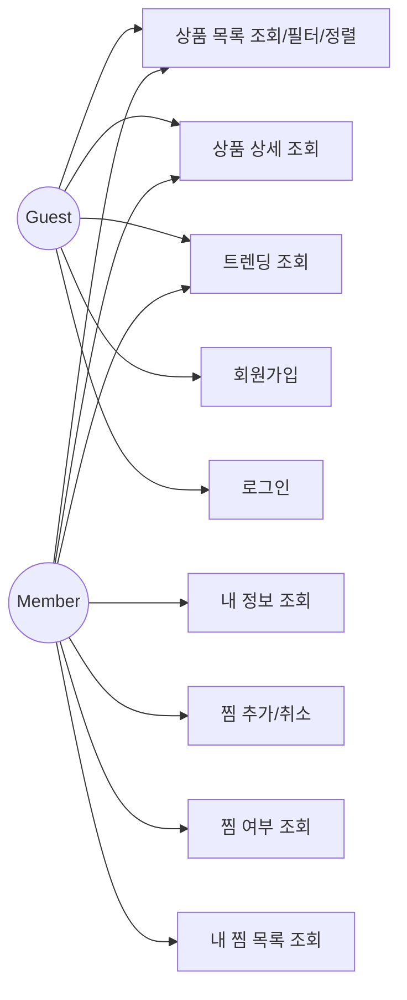

# Use Case Diagram (Backend Scope)

```mermaid
flowchart LR
  Guest((Guest))
  Member((Member))

  Guest --> Browse[상품 목록 조회/필터/정렬]
  Guest --> View[상품 상세 조회]
  Guest --> Trending[트렌딩 조회]
  Guest --> Signup[회원가입]
  Guest --> Login[로그인]

  Member --> Browse
  Member --> View
  Member --> Trending
  Member --> Me[내 정보 조회]
  Member --> Like[찜 추가/취소]
  Member --> LikeStatus[찜 여부 조회]
  Member --> LikesList[내 찜 목록 조회]
```
