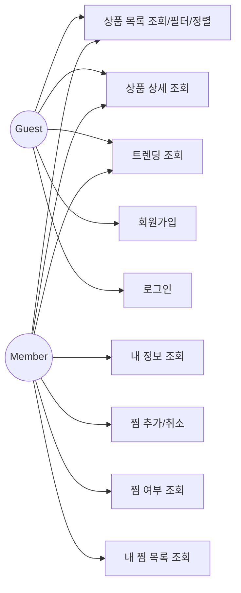
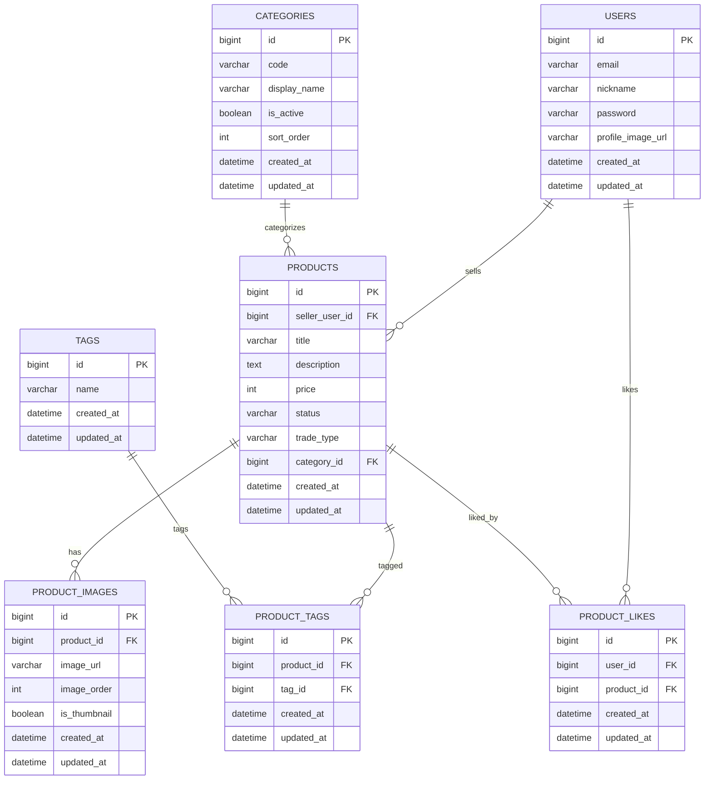
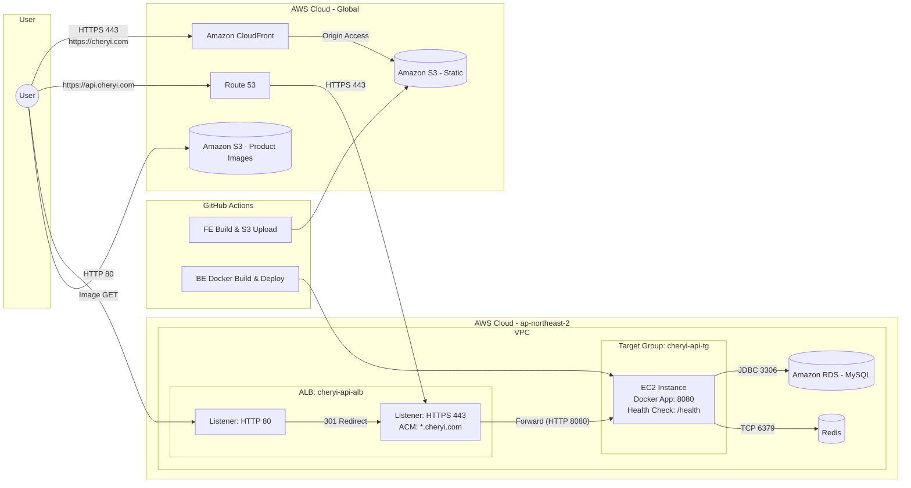

# Architecture Artifacts Implementation Plan

> **For Claude:** REQUIRED SUB-SKILL: Use superpowers:executing-plans to implement this plan task-by-task.

**Goal:** Provide Markdown + Mermaid artifacts for Use Case, ERD, and CI/CD diagrams that match the current Cherry scope, including frontend deployment flow and the media S3 bucket.

**Architecture:** Summarize current backend features and infrastructure based on existing code and `docs/architecture/mvp/ARCHITECTURE.md`. Publish three Mermaid diagrams under `docs/architecture/mvp/mermaid/`. Keep scope to implemented features only (auth, products, likes, tags, categories, images, trending) and current AWS deployment.

**Tech Stack:** Spring Boot, MySQL, Redis, GitHub Actions, Docker, GHCR, AWS (EC2, RDS, ALB, Route53, CloudFront, S3).

---

### Task 1: Create Use Case diagram

**Files:**
- Create: `docs/architecture/mvp/mermaid/use-cases.md`

**Step 1: Write the diagram file**

```markdown
# Use Case Diagram (Backend Scope)


```

**Step 2: Visual check**

Open `docs/architecture/mvp/mermaid/use-cases.md` in GitHub or Markdown preview and confirm the Mermaid diagram renders.

**Step 3: Commit**

```bash
git add docs/architecture/mvp/mermaid/use-cases.md
git commit -m "docs: add use case diagram"
```

---

### Task 2: Create ERD diagram

**Files:**
- Create: `docs/architecture/mvp/mermaid/erd.md`

**Step 1: Write the diagram file**

```markdown
# ERD


```

**Step 2: Visual check**

Open `docs/architecture/mvp/mermaid/erd.md` in GitHub or Markdown preview and confirm the Mermaid diagram renders.

**Step 3: Commit**

```bash
git add docs/architecture/mvp/mermaid/erd.md
git commit -m "docs: add erd diagram"
```

---

### Task 3: Create CI/CD & Runtime diagram (FE + BE)

**Files:**
- Create: `docs/architecture/mvp/mermaid/cicd.md`

**Step 1: Write the diagram file**

```markdown
# CI/CD & Runtime Architecture (Frontend + Backend)


```

**Step 2: Visual check**

Open `docs/architecture/mvp/mermaid/cicd.md` in GitHub or Markdown preview and confirm the Mermaid diagram renders.

**Step 3: Commit**

```bash
git add docs/architecture/mvp/mermaid/cicd.md
git commit -m "docs: add cicd runtime diagram"
```

---

### Task 4: Create index README

**Files:**
- Create: `docs/architecture/mvp/mermaid/README.md`

**Step 1: Write the index file**

```markdown
# Architecture Artifacts

- Use Case: `docs/architecture/mvp/mermaid/use-cases.md`
- ERD: `docs/architecture/mvp/mermaid/erd.md`
- CI/CD & Runtime: `docs/architecture/mvp/mermaid/cicd.md`
```

**Step 2: Commit**

```bash
git add docs/architecture/mvp/mermaid/README.md
git commit -m "docs: add architecture artifacts index"
```

---

Plan complete and saved to `docs/architecture/mvp/plans/2026-01-24-architecture-artifacts.md`.

Two execution options:
1) Subagent-Driven (this session) – requires superpowers:subagent-driven-development  
2) Parallel Session (separate) – use superpowers:executing-plans

Which approach do you want?
