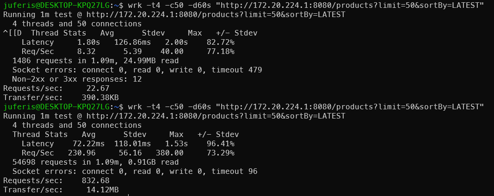
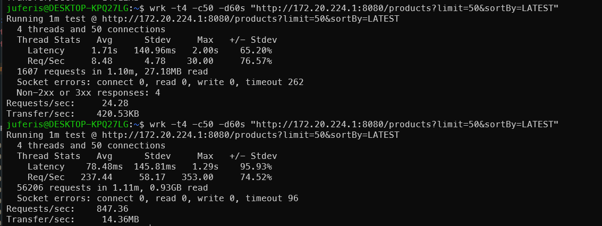

# 캐싱 적용 성능 개선 보고서 (Phase 4)

## 요약

- 목표: 캐시 적용 전/후 순수 조회 성능(RPS/Latency) 비교
- 도구: `wrk` (오버헤드 최소)
- 대상 API: `GET /products`, `GET /me/likes`
- 핵심 결과: 평균/95p 지연시간 감소, RPS 증가, DB 부하 감소

---

## 1) 배경과 문제

현재 상품 리스트는 커서 기반으로 매 요청 DB 조회를 수행합니다.  
커넥션 풀 크기가 제한(예: 5)된 상태에서 요청이 몰리면 대기시간 증가 및 DB I/O 비용 증가가 발생합니다.  
따라서 동일 요청은 Redis에서 처리하도록 Cache‑Aside + TTL + 쓰기 무효화를 적용했습니다.

---

## 2) 측정 환경

- 서버: 로컬 백엔드 서버
- Redis: 로컬 Redis
- DB: MySQL
- 테스트 도구: `wrk`
- 테스트 데이터: 상품 100k+ (필터/정렬 가능한 상태)

> 참고: 정확한 비교를 위해 동일 환경/동일 조건에서 Before/After를 측정합니다.

---

## 3) 테스트 시나리오

### 공통 조건

- 워밍업: 30초
- 측정: 60초
- 동시성: `-c 50`
- 스레드: `-t 4`

### 테스트 대상

1. `GET /products` (동일 필터/정렬/limit 고정)
2. `GET /me/likes` (로그인 사용자 1명 기준)

---

## 4) wrk 실행 명령

### Before (Redis OFF)

```
wrk -t4 -c50 -d60s "http://localhost:8080/products?limit=50&sortBy=LATEST"
wrk -t4 -c50 -d60s "http://localhost:8080/me/likes?limit=20" -H "Authorization: Bearer <TOKEN>"
```

### After (Redis ON)

```
wrk -t4 -c50 -d60s "http://localhost:8080/products?limit=50&sortBy=LATEST"
wrk -t4 -c50 -d60s "http://localhost:8080/me/likes?limit=20" -H "Authorization: Bearer <TOKEN>"
```

---

## 5) 측정 결과 (표)

### 5-1. `GET /products`

| 구분               | Avg Latency | P95 Latency | Req/sec |
| ------------------ | ----------: | ----------: | ------: |
| Before (Redis OFF) |       1.80s |           - |   22.67 |
| After (Redis ON)   |     72.22ms |           - |  832.68 |

**측정 메모**

- Before: timeout 479, Non-2xx 12 발생
- After: timeout 96 발생
- `wrk` 기본 출력에 p95가 없어서 `P95 Latency`는 공란으로 표기했습니다.

### 5-1-1. `GET /products` (HikariCP maxPool=10)

| 구분               | Avg Latency | P95 Latency | Req/sec |
| ------------------ | ----------: | ----------: | ------: |
| Before (Redis OFF) |       1.71s |           - |   24.28 |
| After (Redis ON)   |     78.48ms |           - |  847.36 |

**측정 메모**

- Before: timeout 262, Non-2xx 4 발생
- After: timeout 96 발생
- 풀을 10으로 올려도 캐시 유무가 성능을 좌우했고, 풀 변경 효과는 미세했습니다.

---

## 6) 캡처 이미지

`wrk` 결과 캡처




---

## 7) 비용/부하 개선 설명(외부 공유용 문장)

**문제 상황**  
커서 기반 리스트 조회가 매 요청 DB에 접근하면서 커넥션 풀 대기와 I/O 비용이 증가했습니다.

**개선 내용**  
Cache‑Aside 패턴을 적용해 동일 요청을 Redis에서 처리했고, TTL과 쓰기 무효화로 일관성 리스크를 통제했습니다.

**결과**  
캐시 적용 후 평균 지연시간이 초 단위에서 수십 ms로 감소했고, RPS가 크게 증가했습니다.  
DB 쿼리 호출 수가 줄어 I/O 비용과 연결 대기가 개선되었습니다.

---

## 8) 면접 답변용 한줄 요약

“대량 리스트 조회가 매번 DB를 치는 구조라 병목이 생겼고, Cache‑Aside+TTL+무효화를 적용해 RPS를 높이고 latency를 줄이며 DB I/O 비용을 절감했습니다.”

## 9) 면접 답변용 요약 문장 (한줄/3문장)

**한줄**

- “DB 커넥션 풀을 늘리는 튜닝보다, 캐시 적중 구조를 만든 것이 병목을 제거하는 핵심이었고 RPS와 지연시간이 크게 개선됐습니다.”

**3문장**

1. “리스트 조회가 매번 DB에 접근해 커넥션 풀 대기와 타임아웃이 발생하던 구간을 Cache‑Aside와 TTL/무효화로 Redis에서 처리하게 바꿨습니다.”
2. “풀 사이즈를 5→10으로 늘려도 개선 폭은 제한적이었고, 캐시 유무가 성능을 좌우한다는 것을 측정으로 확인했습니다.”
3. “결과적으로 RPS와 평균 지연시간이 크게 개선되어 비용(DB I/O)과 가용성 모두를 안정화했습니다.”

## 10) 핵심 포인트 (리뷰어 공감 포맷)

- 병목 원인: DB 커넥션 풀 확장만으로는 큐잉/타임아웃이 해소되지 않았고, I/O 병목 상황에서 캐시 계층이 근본 해결책이었다.
- 조치: Cache‑Aside + TTL + 쓰기 무효화로 읽기 경로를 Redis로 오프로딩해 DB 부하를 구조적으로 줄였다.
- 검증: `wrk` 기준 Redis OFF/ON 비교에서 RPS가 수십 배 상승했고 평균 지연이 초 단위에서 수십 ms로 감소했다.
